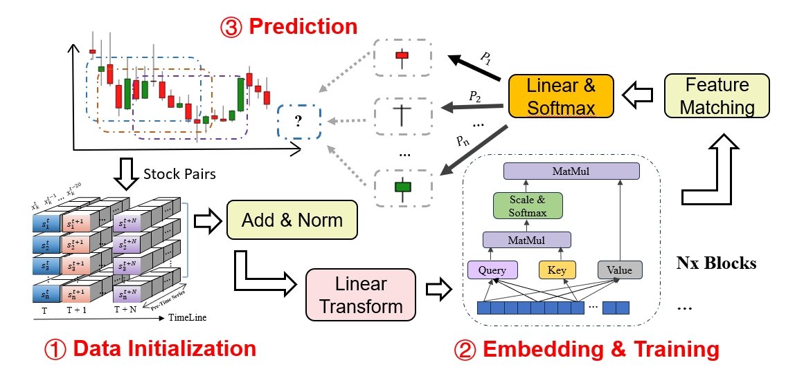

# Quantformer
How to utilize transformer in quantitative financial trading? Here we provide a new model named Quantformer based on the transformer. 

The official implementation code of the work is available now!



## Data collection
The training and backtesting data are collected from [AKShare](https://github.com/akfamily/akshare) and [TuShare](https://github.com/waditu/tushare) from 2010 to 2019. For each stock, the **adjusted** cumulated return and cumulated turnover rate in the setting timestamp will be collected (if training model by return directly, the result may be influenced).

## Model implementation
The code of the model is shown in [quantformer](./Quantformer.ipynb). If necessary, we will upload the code in a py file. 

The model is run in Python 3.8.3 (64-bit), torch version is 2.1.0+cpu and numpy version is 1.23.1. We are not sure if it will work properly under a lower version.

## Backtest
### Trading strategy
Before the first trade date of the timestamp $t$, all sequence $\chi^{t} _{i,k}$ from the stock set $S^t$ will be put in the model and obtain the list of outputs. Then, the stocks will be ranked according to the first element of the output and the first $\frac{1}{q}$ % stocks will be added to the stock pool. If the stock already was in the stock pool on the last timestamp, it will be held; if the stock is in the predicted pool but not in the previous pool, it will be bought in with the same proportion of the whole account. Stocks that are not in the predicted pool will be sold out. The same method is run repeatedly during the subsequent periods. The backtest starts from January 2020, in other words, the result of the sequences from May 2018 to December 2019 will be used as the first stock pool to trade.

If feels difficult to backtest, [JoinQuant](https://www.joinquant.com/) could be a considerable platform to help you with computation. By importing selected IDs of stocks, JoinQuant can simulate trading and show results to you.

### Other Settings
**Transaction fee**: 0.3% for each time long or short

**Trading period**: 01/2020-05/2023

**Adjusted time**: 9:30 am BJT (ITC+08)

## Further collaboration or questions
We are willing to collaborate and discuss this topic with those interested. If you want to further connect, you can contact the corresponding author via the paper in ArXiv by mail [zhangzf@umich.edu](mailto:zhangzf@umich.edu). 

## Citation
Our [paper](https://arxiv.org/abs/2404.00424): *Quantformer: from attention to profit with a quantitative transformer trading strategy* (which had been *From attention to profit: quantitative trading strategy based on transformer*) is available at arXiv.
```bibtex
@unpublished{zhang2024attention,
  title={Quantformer: from attention to profit with a quantitative transformer trading strategy},
  author={Zhang, Zhaofeng and Chen, Banghao and Zhu, Shengxin and Langren{\'e}, Nicolas},
  note={arXiv:2404.00424},
  year={2024}
}


